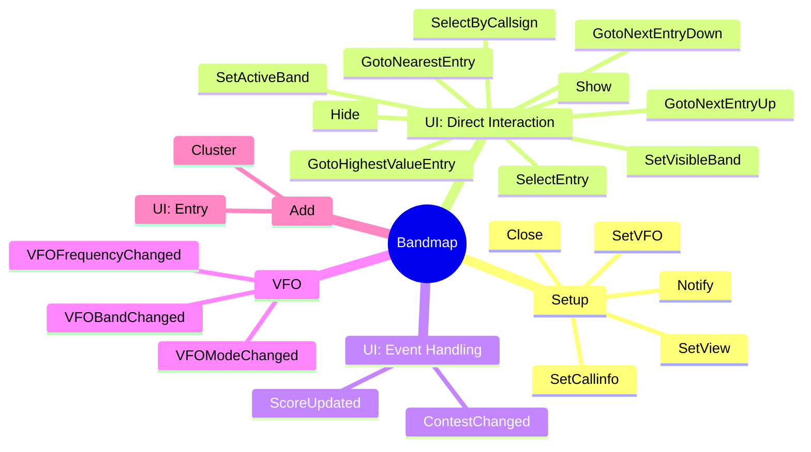

```mermaid
mindmap
  root((Bandmap))
    Setup
        Close
        SetView
        SetVFO
        SetCallinfo
        Notify
    UI: Direct Interaction
        Show
        Hide
        SelectEntry
        SelectByCallsign
        GotoHighestValueEntry
        GotoNearestEntry
        GotoNextEntryUp
        GotoNextEntryDown
        SetVisibleBand
        SetActiveBand
    UI: Event Handling
        ContestChanged
        ScoreUpdated
    VFO
        VFOFrequencyChanged
        VFOBandChanged
        VFOModeChanged
    Add
        UI: Entry
        Cluster
```
