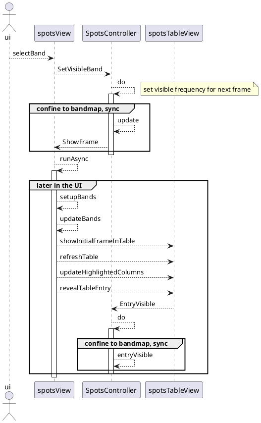
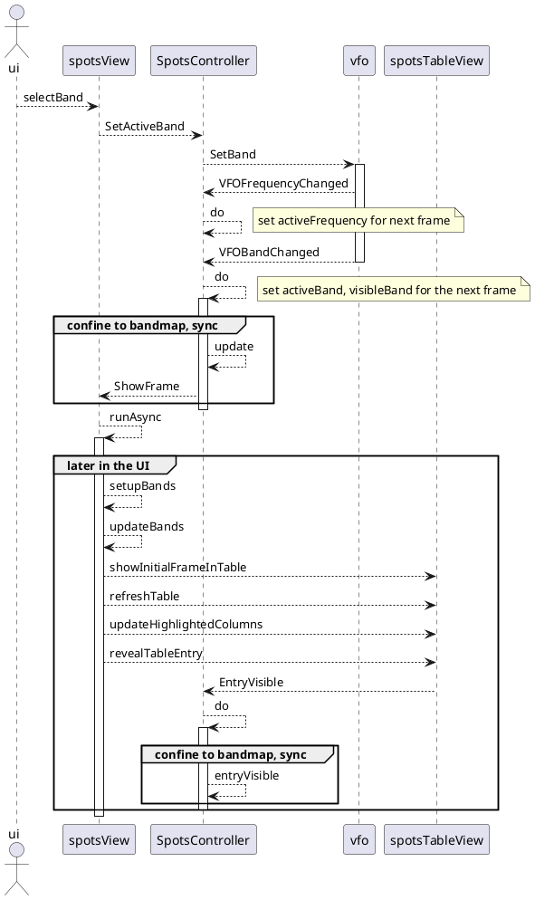
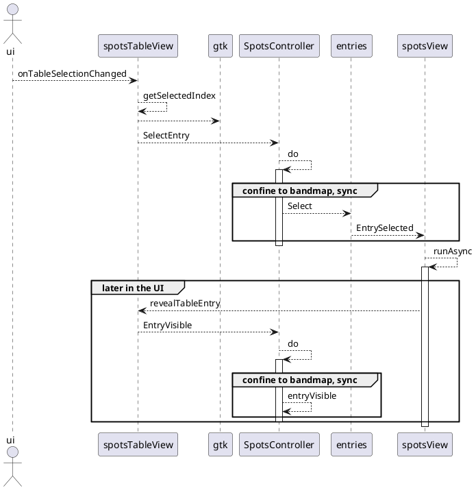
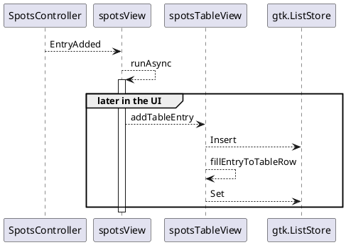
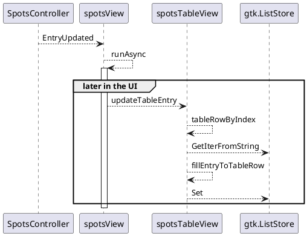
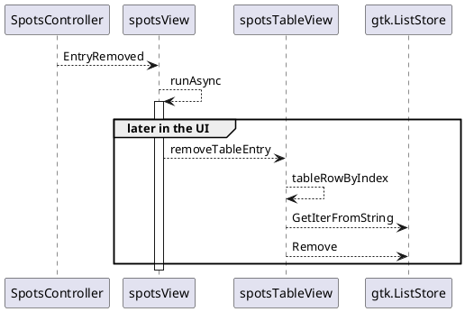
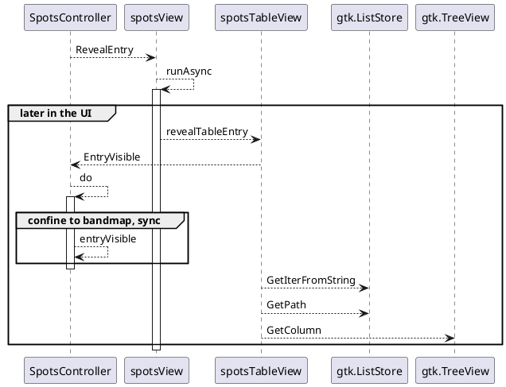

# Bandmap Thread Confinement

The following is a detailed analysis of the thread confinement strategy used in the bandmap feature. I use a bunch of plantuml diagrams to visualize the overall call graph (mis-using a component diagram) and a detailed view on most stimuli using sequence diagrams.

In context of the bandmap feature, keeping track of which thread is doing what is rather complicated because of the complex event system of the tree view widget. This analysis helped me a lot to keep things nice and working.

## Overall Call Graph

```plantuml
@startuml
' Component Structure
component spotsTableView {
    [spotsTableView.setupSpotsTableView]<<gtk>>
    [spotsTableView.fillEntryToTableRow]<<gtk>>
    [spotsTableView.updateHighlightedColumns]<<gtk>>
    [spotsTableView.filterTableRow]<<gtk>>
    [spotsTableView.showInitialFrameInTable]<<gtk>>
    [spotsTableView.addTableEntry]<<gtk>>
    [spotsTableView.updateTableEntry]<<gtk>>
    [spotsTableView.removeTableEntry]<<gtk>>
    [spotsTableView.revealTableEntry]<<gtk>>
    [spotsTableView.refreshTable]<<gtk>>
    [spotsTableView.tableRowByIndex]<<gtk>>
    [spotsTableView.activateTableSelection]<<gtk>>
    [spotsTableView.onTableSelectionChanged]<<gtk>>
    [spotsTableView.getSelectedIndex]<<gtk>>

    [spotsTableView.createSpotMarkupColumn]
    [spotsTableView.createSpotTextColumn]
    [spotsTableView.createSpotListStore]
    [spotsTableView.getEntryColor]
    [spotsTableView.formatSpotFrequency]
    [spotsTableView.formatSpotCall]
    [spotsTableView.formatPoints]
    [spotsTableView.formatSpotAge]
    [spotsTableView.getDXCCInformation]
    [spotsTableView.tableRowByIndex]<<gtk>>
}

component SpotsController {
    [SpotsController.EntryVisible]
    [SpotsController.SelectEntry]
    [SpotsController.SetVisibleBand]
    [SpotsController.SetActiveBand]
    [SpotsController.RemainingLifetime]
}

component spotsView {
    [spotsView.setupSpotsView]<<gtk>>
    [spotsView.setupBands]<<gtk>>
    [spotsView.newBand]<<gtk>>
    [spotsView.updateBand]<<gtk>>
    [spotsView.updateBands]<<gtk>>

    [spotsView.selectBand]<<gtk>>

    [spotsView.ShowFrame]<<runAsync>>
    [spotsView.EntryAdded]<<runAsync>>
    [spotsView.EntryUpdated]<<runAsync>>
    [spotsView.EntryRemoved]<<runAsync>>
    [spotsView.EntrySelected]<<runAsync>>
    [spotsView.RevealEntry]<<runAsync>>
}

' Stimuli
[ui]<<gtk>>
[ui] --> [spotsView.setupSpotsView]
[ui] --> [spotsView.selectBand]
[ui] --> [spotsTableView.activateTableSelection]
[ui] --> [spotsTableView.onTableSelectionChanged]

[SpotsController] --> [spotsView.ShowFrame]
[SpotsController] --> [spotsView.EntryAdded]
[SpotsController] --> [spotsView.EntryUpdated]
[SpotsController] --> [spotsView.EntryRemoved]
[SpotsController] --> [spotsView.EntrySelected]
[SpotsController] --> [spotsView.RevealEntry]

[gtk.TreeModelFilter] --> [spotsTableView.filterTableRow]

' Interactions
[spotsTableView.setupSpotsTableView] --> [spotsTableView.createSpotMarkupColumn]
[spotsTableView.setupSpotsTableView] --> [spotsTableView.createSpotTextColumn]
[spotsTableView.setupSpotsTableView] --> [spotsTableView.createSpotListStore]
[spotsTableView.setupSpotsTableView] --> [gtk]

[spotsTableView.fillEntryToTableRow] --> [spotsTableView.getEntryColor]
[spotsTableView.fillEntryToTableRow] --> [spotsTableView.formatSpotFrequency]
[spotsTableView.fillEntryToTableRow] --> [spotsTableView.formatSpotCall]
[spotsTableView.fillEntryToTableRow] --> [spotsTableView.formatPoints]
[spotsTableView.fillEntryToTableRow] --> [spotsTableView.formatSpotAge]
[spotsTableView.fillEntryToTableRow] --> [spotsTableView.getDXCCInformation]
[spotsTableView.fillEntryToTableRow] --> [gtk]

[spotsTableView.updateHighlightedColumns] --> [spotsTableView.tableRowByIndex]
[spotsTableView.updateHighlightedColumns] --> [spotsTableView.formatSpotFrequency]
[spotsTableView.updateHighlightedColumns] --> [spotsTableView.formatSpotCall]
[spotsTableView.updateHighlightedColumns] --> [spotsTableView.formatSpotAge]

[spotsTableView.filterTableRow] --> [SpotsController.EntryVisible]
[spotsTableView.filterTableRow] --> [gtk]

[spotsTableView.showInitialFrameInTable] --> [spotsTableView.fillEntryToTableRow]
[spotsTableView.showInitialFrameInTable] --> [gtk]

[spotsTableView.addTableEntry] --> [spotsTableView.fillEntryToTableRow]
[spotsTableView.addTableEntry] --> [gtk]

[spotsTableView.updateTableEntry] --> [spotsTableView.tableRowByIndex]
[spotsTableView.updateTableEntry] --> [spotsTableView.fillEntryToTableRow]

[spotsTableView.removeTableEntry] --> [spotsTableView.tableRowByIndex]
[spotsTableView.removeTableEntry] --> [spotsTableView.fillEntryToTableRow]

[spotsTableView.revealTableEntry] --> [SpotsController.EntryVisible]
[spotsTableView.revealTableEntry] --> [gtk]

[spotsTableView.refreshTable] --> [gtk]

[spotsTableView.tableRowByIndex] --> [gtk]

[spotsTableView.activateTableSelection] --> [gtk]

[spotsTableView.onTableSelectionChanged] --> [spotsTableView.getSelectedIndex]
[spotsTableView.onTableSelectionChanged] --> [SpotsController.SelectEntry]
[spotsTableView.onTableSelectionChanged] --> [gtk]

[spotsTableView.getSelectedIndex] --> [gtk]

[spotsView.setupSpotsView] --> [spotsTableView.setupSpotsTableView]

[spotsView.setupBands] --> [spotsView.newBand]
[spotsView.setupBands] --> [gtk]

[spotsView.newBand] --> [spotsView.updateBand]
[spotsView.newBand] --> [gtk]

[spotsView.updateBand] --> [gtk]

[spotsView.updateBands] --> [gtk]

[spotsView.selectBand] --> [SpotsController.SetVisibleBand]
[spotsView.selectBand] --> [SpotsController.SetActiveBand]
[spotsView.selectBand] --> [gtk]

[spotsView.ShowFrame] --> [spotsView.setupBands]
[spotsView.ShowFrame] --> [spotsView.updateBands]
[spotsView.ShowFrame] --> [spotsTableView.showInitialFrameInTable]
[spotsView.ShowFrame] --> [spotsTableView.refreshTable]
[spotsView.ShowFrame] --> [spotsTableView.updateHighlightedColumns]
[spotsView.ShowFrame] --> [spotsTableView.revealTableEntry]

[spotsView.EntryAdded] --> [spotsTableView.addTableEntry]

[spotsView.EntryUpdated] --> [spotsTableView.updateTableEntry]

[spotsView.EntryRemoved] --> [spotsTableView.removeTableEntry]

[spotsView.EntrySelected] --> [spotsTableView.revealTableEntry]

[spotsView.RevealEntry] --> [spotsTableView.revealTableEntry]

@enduml
```

## Select the visible band

## Select the active band

## Select a table entry

## Add an entry coming from the DX cluster

## Update an existing table entry due to changes coming from the DX cluster

## Remove a stale table entry

## Reveal an entry

