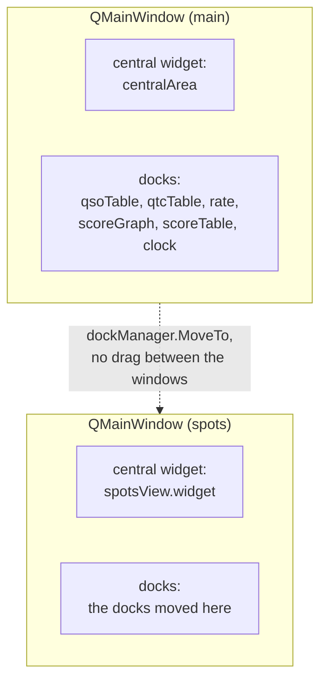

# The Spot Window

The spot list lives in its own top-level window (`ui/spotWindow.go`), not in a dock of the
main window. The spot window is a second `QMainWindow`, so it provides dock areas of its own
and can host the dockable views (QSO list, rate, score, clock, ...) next to the spot list.



## Qt constraint: docks cannot be dragged between main windows

Qt6 offers **no** way to let the user drag a `QDockWidget` from one `QMainWindow` into
another one. The drag target is resolved through the dock's *parent chain*, in
`qtbase/src/widgets/widgets/qdockwidget.cpp`:

```cpp
static const QMainWindow *mainwindow_from_dock(const QDockWidget *dock)
{
    for (const QWidget *p = dock->parentWidget(); p; p = p->parentWidget())
        if (const QMainWindow *window = qobject_cast<const QMainWindow*>(p))
            return window;
    return nullptr;
}
```

`QDockWidgetPrivate::mouseMoveEvent()` only hovers the layout of that one main window. Other
top-level main windows are never hit-tested, no matter how the dock is configured. The
third-party frameworks that do support this (KDDockWidgets, Qt Advanced Docking System) are
C++-only and have no miqt bindings.

What *does* work is moving a dock programmatically:

```go
spotWindow.window.AddDockWidget(qtlib.RightDockWidgetArea, view.Dock())
```

`AddDockWidget` reparents the dock, and afterwards the dock drags normally *inside* its new
main window.

## Moving a dock between the windows

`ui/dockManager.go` owns all dockable views and their current window. A right click on a
dock opens a context menu with one entry, `Move to Spot Window` or `Move to Main Window`,
depending on the window the dock is in.

The dock, not the main window, carries the context menu: `SetContextMenuPolicy(CustomContextMenu)`
plus `OnCustomContextMenuRequested`. A right click in the content widget also arrives at the
dock, because a `QEvent::ContextMenu` event propagates to the parent widget if the child
ignores it. A child with its own context menu, for example a `QLineEdit`, keeps the event.

This replaces the automatic menu of `QMainWindow::createPopupMenu()`, which a right click on
a dock title bar showed before.

The move is a UI function only. It has no action ID in `core/actions.go`, therefore it has
no keyboard shortcut and the remote interface cannot trigger it.

## Persisted state

Both windows store geometry and dock layout separately via `QSettings`
(`ui/windowState.go`):

| Key | Content |
| --- | --- |
| `ui/mainWindowGeometry`, `ui/mainWindowState` | main window, unchanged keys from before the split |
| `ui/spotWindowGeometry`, `ui/spotWindowState` | spot window |
| `ui/spotWindowVisible` | whether the spot window was open on exit |
| `ui/dockTarget/<objectName>` | `main` or `spots` per dockable view (`ui/dockManager.go`) |

`QMainWindow::restoreState()` only restores docks that are children of that window at the
time of the call. Therefore `dockManager.Restore()` runs **before** both windows restore
their state, so that every dock already belongs to its window. `RestoreDockWidget()` covers
docks that are created later.

## Lifecycle

- The spot window is unparented, so it gets its own taskbar entry and independent stacking.
- Closing it only hides it: `QWidget::close()` hides the widget unless `WA_DeleteOnClose`
  is set, so the dock layout survives. Window ▸ Spots brings it back via
  `Controller.ShowSpots()` (`core/app/app.go`).
- Do **not** veto the spot window's close event to keep it open: quitting the application
  closes all top-level windows first, and a vetoed close also vetoes the quit. The
  application then keeps running with all windows hidden.
- Closing the main window closes the spot window, too (`ui/app.go`), otherwise the
  application would keep running without a visible main window.
- The window state of both windows is stored by `storeWindowStateOnce()`, called from the
  main window's close event and from `Quit()`. It only stores on the first call, because
  quitting closes all windows and the spot window may already be closed on later calls.
